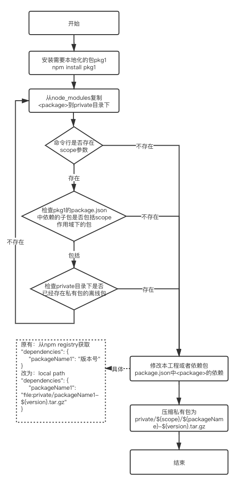

# npm-package-privatify
## 说明
一个将私有源npm包处理为离线包的自动化工具
<br>

## 使用
### 安装
```js
npm install -g npm-package-privatify
```
<br>

### 1、privatify package \<package\> [scope]

将所声明的npm包package处理为离线包，并查找离线包package子包依赖是否包含scope下的子包，如包含也处理为离线包

> scope匹配规则：https://www.npmjs.com/package/minimatch

参数：
#### \<package\>：npm包名

```js
// 将packageName处理为私包
privatify package packageName
```
执行成功后，有两处变化：

（1）本工程package.json
```json
// 修改前
...
"dependencies|| devDependencies": {
    "packageName": "^0.3.29",
},
// 修改后
...
"dependencies|| devDependencies": {
    "packageName": "file:private/packageName-${version}.tar.gz",
},
```
（2）路径`private`下新增文件`packageName-${version}.tar.gz`

####  [scope]：查找包是否存在scope下的依赖，有则会处理子包私有包
```
privatify package @scope1/packageName @scope1
```
执行成功后，除了跟上述一样有两处变化，如果子包有依赖scope下的私有包，还有两处变化：

（3）private/@scope1/packageName下的package.json文件
```json
// 修改前
...
"dependencies|| devDependencies": {
    "@scope1/subPackageName": "^0.3.29",
},
// 修改后
...
"dependencies|| devDependencies": {
    "@scope1/subPackageName": "file:../../private/@scope1/packageName-${version}.tar.gz",
},
```
（4） 路径`private/@scope1`下新增文件`subPackageName-${version}.tar.gz`

<br>

### 2、privatify scope \<scope\>

提供快捷操作，将所声明作用域下的私有包统一处理为离线包，查找包是否存在scope下的依赖，有则会处理子包私有包

参数：
#### \<scope\>：要查找的作用域

> scope匹配规则：https://www.npmjs.com/package/minimatch

```js
// 将在@scope1下的私有包处理为私包
privatify scope @scope1
```

<br>

## 实现流程



## 常见问题
Q: 多个子包依赖包中依赖同一个私有包，但是版本不一样?

A: 本工具区分了版本，自动处理了此问题
